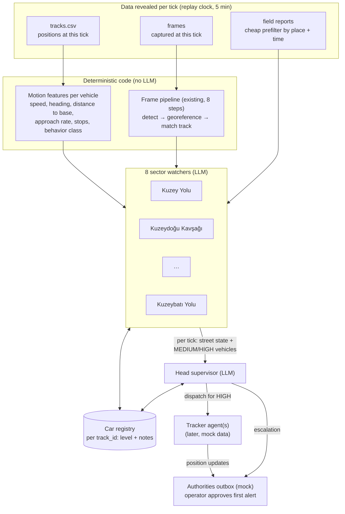
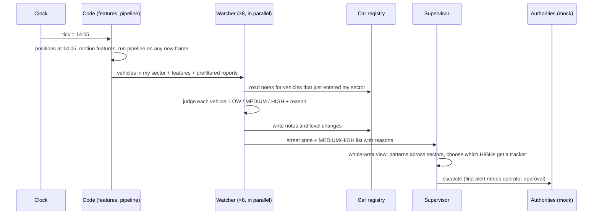
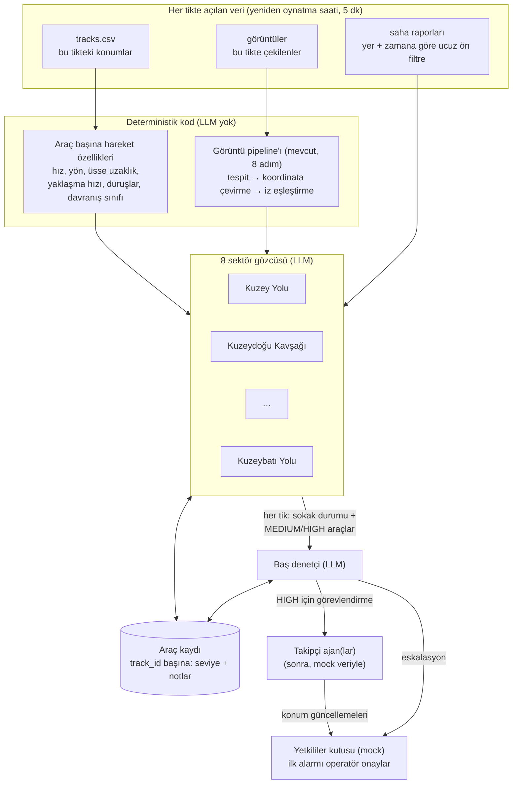
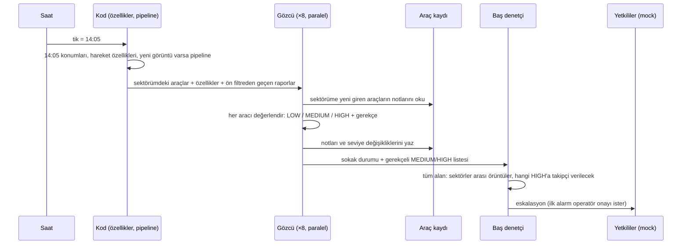

# Agent Flow: Watch Mode (high level)

> 🇹🇷 Türkçe sürüm için: [aşağıya bakın](#tr).

**Status:** agreed design, not implemented yet. Contracts (models, SSE events, tool schemas) go into `docs/AGENT_DESIGN.md` in the same change as the first watch-mode code; until then, this file is the reference for how the agents fit together. Prompts, tools, models and example inputs/outputs: [`AGENT_PROMPTS_AND_TOOLS.md`](AGENT_PROMPTS_AND_TOOLS.md).

**Current implementation:** 4 watchers share the 8 sectors and take turns (each checks one sector of its 2-sector area per tick; a sector with a drone frame is checked out of turn), trackers are switched off, and the supervisor informs the human operator with a described alert instead of dispatching anyone. Frames run through the YOLO model, so vehicles seen in a frame get their type. Details: [`AGENT_DESIGN.md`](AGENT_DESIGN.md) §12.

**In one paragraph:** we replay the monitoring day on a clock that advances in 5-minute steps. Eight **watcher** agents each observe one sector around the base and rate every vehicle in it as LOW, MEDIUM or HIGH. Watchers leave notes on vehicles in a shared **car registry**, so when a vehicle drives into the next sector, the next watcher knows its history. At every step, each watcher sends a short status message to a **head supervisor** agent. The supervisor looks at the whole picture, spots patterns no single sector can see, and dispatches a **tracker** agent for HIGH-risk vehicles, which then reports the vehicle's position to the authorities (mocked).

---

## 1. Terms

| Term | Meaning |
|---|---|
| **Frame** | One of the 40 drone images (`images/`, `image_meta.json`). Each has one capture time (10:10–15:50, all different) and four corner coordinates. |
| **Track** | The recorded route of one vehicle: its position every 5 min for the 2 h before a frame was captured. 226 tracks × 25 points in `tracks.csv`. The last point of every track is exactly at its frame's capture time. |
| **Track ID** | The name of a track, e.g. `T0122`. Our key for "this vehicle" everywhere (registry, notes, messages). A frame has no IDs; the pipeline links a detected box to a track by position (`match_tracks`). |
| **Tick** | One step of the replay clock = 5 minutes. The data spans 08:10–15:50 = **93 ticks**. At each tick, the track positions with `time == tick` become visible, plus any frame captured at that minute. Nothing from the future is visible. |
| **Sector** | The area a watcher is responsible for: every point belongs to the nearest of the 8 zone centers in `zones.json` (the zones sit on a 3.2 km ring around the base, 45° apart). |
| **Level** | A watcher's rating of one vehicle: `LOW`, `MEDIUM` or `HIGH`. (The per-frame brief keeps its own four-level rubric; see `AGENT_DESIGN.md` §3.) |
| **Note** | A short, evidence-backed remark a watcher attaches to a vehicle in the registry ("second long stop within 6 km, working around the base"). |

---

## 2. The big picture



**The one rule behind the split:** *code computes, the LLM judges.* No agent ever calculates a speed or a distance from raw coordinates. Code hands each agent a ready-made table; the agent decides what it means and must cite evidence IDs (`TRK-T0122`, `DET-2`, `REP-07`) for every claim.

---

## 3. What happens in one tick



1. **Clock advances** one tick.
2. **Code prepares facts:** the position of every active vehicle, its motion features over the route so far, its behavior class, and (if a frame was captured this minute) the full frame pipeline result, which confirms vehicle type by detection.
3. **Each watcher** gets the vehicles in its sector. For a vehicle that just entered, it also gets the **full route so far + all notes**, not just the current point.
4. **Each watcher rates** every vehicle and writes notes / level changes to the registry.
5. **Each watcher messages the supervisor** (format in §5).
6. **The supervisor** updates its board and acts: dispatch a tracker, escalate, or keep watching.

The 8 watchers run in parallel, so one tick costs about one watcher call plus one supervisor call in wall time.

---

## 4. The agents

### Sector watcher (×8, LLM)

| | |
|---|---|
| **Sees** | Vehicles currently in its sector with code-computed features; route so far + notes for new arrivals; frame results when a frame arrives; field reports that pass the prefilter for its sector and time window. |
| **Decides** | A level per vehicle, with a one-sentence reason and evidence IDs. |
| **Writes** | Notes and level changes in the car registry; one message per tick to the supervisor. |
| **Tools** | `get_route(track_id)` (route so far + features + behavior class), `get_notes(track_id)`, `get_reports(...)`, and `submit_watch_report(...)` to finish the tick (levels, reasons and new notes in one call). Full schemas: [`AGENT_PROMPTS_AND_TOOLS.md`](AGENT_PROMPTS_AND_TOOLS.md) §4. |
| **Cannot** | Lower a vehicle's level (only the supervisor can lower a HIGH). Trust a report over its own sensors. |
| **If the LLM fails** | The deterministic rubric sets the levels for that tick and the timeline shows a warning. The demo never stalls. |

What each level means for the flow:

- **LOW**: nothing is sent; the vehicle is only counted in the street state.
- **MEDIUM**: the watcher leaves a note on the vehicle. Whichever watcher sees it next reads that note and may raise it to HIGH. MEDIUM vehicles are listed to the supervisor, but no tracker is sent.
- **HIGH**: listed to the supervisor as a candidate for a tracker.

### Head supervisor (×1, LLM)

| | |
|---|---|
| **Sees** | The latest message from each of the 8 watchers + a short list of recent events (new HIGHs, trackers out, alerts sent). Its prompt does **not** grow over the day: it always holds the current board, not the full history. |
| **Does what only it can** | Spots cross-sector patterns (e.g. three MEDIUM vehicles from different sectors closing on the base in the same half hour); decides which HIGH vehicles get one of the limited trackers; judges area-wide reports ("friendly exercise in the region all day") that no single sector should judge. |
| **Tools** | `get_route(track_id)`, `get_notes(track_id)`, `set_level(track_id, level, reason)` (the only way to lower a HIGH), `dispatch_tracker(track_id, suspicion)`, `recall_tracker(tracker_id, reason)`, `notify_authorities(track_ids, urgency, headline, suspicion)`, and `submit_supervisor_decision(...)` to finish the tick. Full schemas: [`AGENT_PROMPTS_AND_TOOLS.md`](AGENT_PROMPTS_AND_TOOLS.md) §5. |
| **Must state** | For every dispatch or escalation: the suspicion (what it believes), the evidence IDs, and what would clear the vehicle. The validator rejects a dispatch without them. |

### Tracker (later; needs mock data)

Sticks to one vehicle for as long as possible and sends position updates to the authorities outbox. It follows the real track while one exists, then continues on **mock track extensions** (no new images) with a growing uncertainty radius; every update is labelled `REAL` or `SIMULATED`. Scheduled in `PLAN.md` §10 for when the mock data is added.

---

## 5. Messages and the registry

**Watcher → supervisor, every tick** (LOW vehicles never appear individually):

```json
{
  "tick": "14:05",
  "sector": "Dogu Yolu",
  "street_state": "9 vehicles: 6 moving, 3 parked. Traffic normal apart from one fast approach.",
  "suspicious": [
    {
      "track_id": "T0122",
      "level": "HIGH",
      "reason": "Stop-and-go around the north side (45, 20, 45 min stops), now closing on the base at ~250 m/min.",
      "evidence_ids": ["TRK-T0122"],
      "since": "14:05"
    }
  ]
}
```

**Car registry entry** (shared by all agents, append-only notes):

```json
{
  "track_id": "T0122",
  "level": "HIGH",
  "notes": [
    {"tick": "12:50", "sector": "Kuzey Yolu",        "level": "MEDIUM", "reason": "Parked 45 min 6 km north of base."},
    {"tick": "13:55", "sector": "Kuzeydogu Kavsagi", "level": "MEDIUM", "reason": "Two more long stops while moving around the base."},
    {"tick": "14:05", "sector": "Dogu Yolu",         "level": "HIGH",   "reason": "Now driving straight at the base."}
  ]
}
```

Level rules: watchers can only raise a level; a change needs two consecutive ticks to stick (no flicker); only the supervisor lowers a HIGH; the supervisor may act on a first-tick HIGH when it is part of a cross-sector pattern; a field report never lowers a level on its own.

---

## 6. Field reports

Reports are untrusted text: some are true, some are wrong on purpose or by mistake, some are irrelevant. Handling:

1. **Cheap prefilter (code, once at startup):** extract coordinates / zone names / vehicle and activity keywords with rules (`services/reports.py`), then keep a report for a sector only if it is near that sector and inside the relevant time window. No LLM needed to decide *where* a report belongs.
2. **Judgment (LLM, inside the watcher):** compare the report's claim (type, count, moving vs stationary) with our own sensors: `CORROBORATED`, `CONTRADICTED`, `UNVERIFIED` or `IRRELEVANT`.
3. **Trust order:** own detection + track > official report > third-party report. A claim that would *lower* the threat ("friendly unit", "identity verified") and that our data cannot confirm never lowers a level.

Report text is always passed as quoted data, never as instructions.

---

## 7. Worked example: T0122 across three sectors

Real data. This is also the organizers' golden example (`img_000860`).

| Ticks | Where / what happens | Who sees it | Result |
|---|---|---|---|
| 12:10–12:50 | Parked 6 km north of the base for 45 min | Kuzey Yolu watcher | LOW, or MEDIUM + note "long stop" |
| 12:55–13:55 | Hops east, parks 20 min, hops again, parks 45 min (still ~5.5 km out) | Kuzeydoğu Kavşağı watcher, reading the earlier note | MEDIUM + note "stop-and-go around the base" |
| 14:00–14:05 | Drives straight at the base: 5.3 → 4.1 km in 5 min | Doğu Yolu watcher, reading both notes | **HIGH** → listed to the supervisor |
| 14:10 | Frame `img_000860` captured: detection confirms a **truck**, 1.65 km from the base | Doğu Yolu watcher + frame pipeline | Supervisor dispatches a tracker, first alert goes to the operator for approval |

Two *official* reports point at this exact spot and both sound reassuring: 12:25 "the car coming to the base from 39.92538N 32.87130E is our unit, announced in advance" and 12:35 "one heavy vehicle at 39.9253N 32.8718E, movements normal". Our own data disagrees: at 12:25 and 12:35 no tracked vehicle was within ~760 m of that spot (T0122 was parked 6 km north), and the vehicle that did arrive is a truck, not a car. Neither report may lower the level.

Without tracks this hand-off could not happen: **no vehicle appears in more than one frame.** With tracks, 168 of the 226 vehicles pass through two or more sectors during their 2 h (391 sector changes in total).

---

## 8. Real vs simulated

| Part | Source |
|---|---|
| Vehicle positions for the 2 h before each frame | **Real** (`tracks.csv`), replayed tick by tick |
| Detections, vehicle type, georeferencing | **Real** (Stage 1 model on the 40 frames) |
| Field reports | **Real** (`field_reports.json`) |
| Vehicles before their track starts / after their frame | Not in the data; tracks appear 2 h before their frame and end at it |
| Tracker following a vehicle after its track ends | **Simulated** (mock track extension), later |
| Re-finding a vehicle on another camera | **Simulated** only, backlog (`PLAN.md` §10) |
| Authorities | **Mock** outbox |

**Assumption to state on the slides:** the organizers deliver tracks as the history behind each frame; we replay them as if ground sensors had logged these positions live.

---

## 9. Guardrails (apply to every agent)

- **Code computes, the LLM judges.** Every number in a message, note or alert comes from a deterministic tool.
- **Every claim cites evidence IDs.** Unknown IDs fail validation.
- **Degrade, never crash.** An LLM failure falls back to the deterministic rubric for that tick and shows a warning.
- **Pluggable model.** All agents talk to one small LLM-client interface; the organizer's GLM gateway (`glm-5.3-flash`) is the default, and other OpenAI-compatible providers can plug in.
- **Bounded cost.** Each agent call has a tool-call cap; a full day replay is recorded so the demo can replay it without the API.

---

## 10. Build order

1. Replay clock + motion features per tick + car registry (code only; the rubric acts as the watchers).
2. LLM sector watchers with notes and hand-off.
3. Supervisor messages, board and escalation to the mock authorities outbox.
4. Scoring fixes (add points for looping around the base; stop rating parked vehicles ~1.6 km out as MEDIUM) and an evaluation slide: are the 5 base-looping vehicles and the HIGH vehicles flagged, how early, how many false alarms, and do misleading reports ever lower a level.
5. Later: mock track extension + trackers; camera re-sighting (both in `PLAN.md` §10).
6. Later: the operator dispatches extra watchers by talking to the supervisor, which calls `dispatch_watcher(target, reason, until?)` (target = sector, `track_id` or area) and `recall_watcher(watcher_id, reason)` (`PLAN.md` §10).

---
---

<a id="tr"></a>

# Ajan Akışı: İzleme Modu (üst düzey) — Türkçe

**Durum:** üzerinde anlaşılmış tasarım, henüz kodlanmadı. Sözleşmeler (modeller, SSE olayları, araç şemaları) ilk izleme modu koduyla aynı değişiklikte `docs/AGENT_DESIGN.md` dosyasına eklenecek; o zamana kadar ajanların nasıl bir araya geldiğinin referansı bu dosyadır. Koddaki adlarla eşleşsin diye İngilizce terimler parantez içinde verilmiştir.

**Güncel uygulama:** 4 gözcü 8 sektörü paylaşır ve sırayla kontrol eder (her biri her tikte 2 sektörlük alanından birine bakar; drone görüntüsü gelen sektör sırası beklenmeden kontrol edilir), takipçiler kapalıdır ve baş denetçi kimseyi görevlendirmek yerine insan operatörü açıklamalı bir uyarıyla bilgilendirir. Görüntüler YOLO modelinden geçer; görüntüde görülen araçların tipi belirlenir. Ayrıntılar: [`AGENT_DESIGN.md`](AGENT_DESIGN.md) §12.

**Tek paragrafta:** İzleme gününü 5 dakikalık adımlarla ilerleyen bir saat üzerinde yeniden oynatıyoruz. Sekiz **gözcü** (watcher) ajan, üssün etrafındaki birer sektörü izler ve oradaki her aracı LOW, MEDIUM veya HIGH olarak derecelendirir. Gözcüler araçlara ortak bir **araç kaydında** (car registry) not bırakır; böylece bir araç komşu sektöre geçtiğinde, oradaki gözcü aracın geçmişini bilir. Her adımda her gözcü, **baş denetçi** (head supervisor) ajana kısa bir durum mesajı gönderir. Baş denetçi bütün resmi görür, tek bir sektörün göremeyeceği örüntüleri yakalar ve HIGH riskli araçlar için bir **takipçi** (tracker) ajan görevlendirir; takipçi aracın konumunu yetkililere bildirir (mock).

---

## 1. Terimler

| Terim | Anlamı |
|---|---|
| **Görüntü** (frame) | 40 drone görüntüsünden biri (`images/`, `image_meta.json`). Her birinin tek bir çekim saati (10:10–15:50, hepsi farklı) ve dört köşe koordinatı vardır. |
| **İz** (track) | Bir aracın kayıtlı rotası: bir görüntü çekilmeden önceki 2 saat boyunca her 5 dakikada bir konumu. `tracks.csv` içinde 226 iz × 25 nokta. Her izin son noktası tam olarak ait olduğu görüntünün çekim saatindedir. |
| **İz kimliği** (track ID) | Bir izin adı, ör. `T0122`. Her yerde (kayıt, notlar, mesajlar) "bu araç" için anahtarımız. Görüntüde kimlik yoktur; pipeline tespit edilen kutuyu konuma göre bir ize bağlar (`match_tracks`). |
| **Tik** (tick) | Yeniden oynatma saatinin bir adımı = 5 dakika. Veri 08:10–15:50 arasını kapsar = **93 tik**. Her tikte `time == tik` olan iz konumları ve o dakikada çekilmiş görüntü (varsa) görünür hale gelir. Gelecekten hiçbir şey görünmez. |
| **Sektör** (sector) | Bir gözcünün sorumlu olduğu alan: her nokta, `zones.json` içindeki 8 bölge merkezinden en yakınına aittir (bölgeler üssün etrafında 3,2 km yarıçaplı bir halka üzerinde, 45° arayla durur). |
| **Seviye** (level) | Bir gözcünün bir araç için verdiği derece: `LOW`, `MEDIUM` veya `HIGH`. (Görüntü başına brief kendi dört seviyeli puanlamasını korur; bkz. `AGENT_DESIGN.md` §3.) |
| **Not** (note) | Gözcünün bir araca eklediği kısa, kanıta dayalı açıklama ("üsse 6 km içinde ikinci uzun duruş, üssün çevresinde dolaşıyor"). |

---

## 2. Genel resim



**Bu ayrımın arkasındaki tek kural:** *kod hesaplar, LLM yorumlar.* Hiçbir ajan ham koordinatlardan hız veya mesafe hesaplamaz. Kod her ajana hazır bir tablo verir; ajan bunun ne anlama geldiğine karar verir ve her iddiası için kanıt kimliği (`TRK-T0122`, `DET-2`, `REP-07`) göstermek zorundadır.

---

## 3. Bir tikte neler olur



1. **Saat** bir tik ilerler.
2. **Kod gerçekleri hazırlar:** aktif her aracın konumu, o ana kadarki rotası üzerinden hareket özellikleri, davranış sınıfı ve (bu dakikada bir görüntü çekildiyse) araç tipini tespitle doğrulayan tam görüntü pipeline'ı sonucu.
3. **Her gözcü** kendi sektöründeki araçları alır. Sektöre yeni giren bir araç için yalnızca anlık noktayı değil, **o ana kadarki tüm rotayı + tüm notları** da alır.
4. **Her gözcü** her aracı derecelendirir ve notları / seviye değişikliklerini kayda yazar.
5. **Her gözcü baş denetçiye mesaj gönderir** (biçim §5'te).
6. **Baş denetçi** tablosunu günceller ve harekete geçer: takipçi görevlendirir, eskale eder ya da izlemeye devam eder.

8 gözcü paralel çalışır; bu yüzden bir tik, gerçek zamanda yaklaşık bir gözcü çağrısı artı bir baş denetçi çağrısı sürer.

---

## 4. Ajanlar

### Sektör gözcüsü (×8, LLM)

| | |
|---|---|
| **Görür** | Sektöründeki araçlar ve kodun hesapladığı özellikleri; yeni gelenler için o ana kadarki rota + notlar; görüntü geldiğinde görüntü sonuçları; kendi sektörü ve zaman penceresi için ön filtreden geçen saha raporları. |
| **Karar verir** | Araç başına bir seviye, tek cümlelik gerekçe ve kanıt kimlikleriyle. |
| **Yazar** | Araç kaydına notlar ve seviye değişiklikleri; her tikte baş denetçiye bir mesaj. |
| **Araçları** | `get_route(track_id)` (o ana kadarki rota + özellikler + davranış sınıfı), `get_notes(track_id)`, `get_reports(...)` ve tiki bitirmek için `submit_watch_report(...)` (seviyeler, gerekçeler ve yeni notlar tek çağrıda). Tam şemalar: [`AGENT_PROMPTS_AND_TOOLS.md`](AGENT_PROMPTS_AND_TOOLS.md) §4. |
| **Yapamaz** | Bir aracın seviyesini düşüremez (bir HIGH'ı yalnızca baş denetçi düşürebilir). Bir rapora kendi sensörlerinden fazla güvenemez. |
| **LLM başarısız olursa** | O tik için seviyeleri deterministik puanlama belirler ve zaman çizelgesinde bir uyarı görünür. Demo asla takılmaz. |

Her seviyenin akıştaki anlamı:

- **LOW**: hiçbir şey gönderilmez; araç yalnızca sokak durumunda sayılır.
- **MEDIUM**: gözcü araca bir not bırakır. Aracı sonra hangi gözcü görürse o notu okur ve seviyeyi HIGH'a çıkarabilir. MEDIUM araçlar baş denetçiye listelenir ama takipçi gönderilmez.
- **HIGH**: takipçi adayı olarak baş denetçiye listelenir.

### Baş denetçi (×1, LLM)

| | |
|---|---|
| **Görür** | 8 gözcünün her birinden gelen en son mesaj + kısa bir son olaylar listesi (yeni HIGH'lar, sahadaki takipçiler, gönderilen alarmlar). Prompt'u gün boyunca **büyümez**: her zaman tüm geçmişi değil, güncel tabloyu tutar. |
| **Yalnızca onun yapabileceği işler** | Sektörler arası örüntüleri yakalar (ör. farklı sektörlerden üç MEDIUM aracın aynı yarım saatte üsse yaklaşması); sınırlı sayıdaki takipçinin hangi HIGH araçlara verileceğine karar verir; tek bir sektörün yargılamaması gereken bölge çapındaki raporları değerlendirir ("gün boyu bölgede dost unsurlarla tatbikat var"). |
| **Araçları** | `get_route(track_id)`, `get_notes(track_id)`, `set_level(track_id, level, reason)` (bir HIGH'ı düşürmenin tek yolu), `dispatch_tracker(track_id, suspicion)`, `recall_tracker(tracker_id, reason)`, `notify_authorities(track_ids, urgency, headline, suspicion)` ve tiki bitirmek için `submit_supervisor_decision(...)`. Tam şemalar: [`AGENT_PROMPTS_AND_TOOLS.md`](AGENT_PROMPTS_AND_TOOLS.md) §5. |
| **Belirtmek zorundadır** | Her görevlendirme veya eskalasyonda: şüphenin ne olduğu, kanıt kimlikleri ve aracı neyin temize çıkaracağı. Bunlar olmadan yapılan bir görevlendirmeyi doğrulayıcı reddeder. |

### Takipçi (sonra; mock veri gerektirir)

Bir araca mümkün olduğunca uzun süre yapışır ve yetkililer kutusuna konum güncellemeleri gönderir. Gerçek iz var olduğu sürece onu izler, sonra **mock iz uzantıları** üzerinden (yeni görüntü olmadan), giderek büyüyen bir belirsizlik yarıçapıyla devam eder; her güncelleme `REAL` veya `SIMULATED` olarak etiketlenir. Mock veri eklendiğinde yapılmak üzere `PLAN.md` §10'da planlandı.

---

## 5. Mesajlar ve araç kaydı

**Gözcü → baş denetçi, her tik** (LOW araçlar tek tek hiç görünmez). Alan adları koddaki gibi İngilizcedir:

```json
{
  "tick": "14:05",
  "sector": "Dogu Yolu",
  "street_state": "9 araç: 6'sı hareket halinde, 3'ü park halinde. Tek bir hızlı yaklaşma dışında trafik normal.",
  "suspicious": [
    {
      "track_id": "T0122",
      "level": "HIGH",
      "reason": "Üssün kuzeyinde dur-kalk (45, 20, 45 dk duruş), şimdi üsse ~250 m/dk ile yaklaşıyor.",
      "evidence_ids": ["TRK-T0122"],
      "since": "14:05"
    }
  ]
}
```

**Araç kaydı girdisi** (tüm ajanlarca paylaşılır, notlar yalnızca eklenir):

```json
{
  "track_id": "T0122",
  "level": "HIGH",
  "notes": [
    {"tick": "12:50", "sector": "Kuzey Yolu",        "level": "MEDIUM", "reason": "Üssün 6 km kuzeyinde 45 dk park."},
    {"tick": "13:55", "sector": "Kuzeydogu Kavsagi", "level": "MEDIUM", "reason": "Üssün çevresinde dolaşırken iki uzun duruş daha."},
    {"tick": "14:05", "sector": "Dogu Yolu",         "level": "HIGH",   "reason": "Şimdi doğrudan üsse doğru ilerliyor."}
  ]
}
```

Seviye kuralları: gözcüler seviyeyi yalnızca yükseltebilir; bir değişikliğin kalıcı olması için iki ardışık tik gerekir (seviye sürekli gidip gelmesin diye); bir HIGH'ı yalnızca baş denetçi düşürür; baş denetçi, sektörler arası bir örüntünün parçasıysa ilk tikteki bir HIGH için de harekete geçebilir; bir saha raporu tek başına seviyeyi asla düşürmez.

---

## 6. Saha raporları

Raporlar güvenilmeyen metinlerdir: bazıları doğru, bazıları kasıtlı ya da yanlışlıkla hatalı, bazıları ilgisizdir. İşleyiş:

1. **Ucuz ön filtre (kod, açılışta bir kez):** kurallarla koordinatları / bölge adlarını / araç ve hareket anahtar kelimelerini çıkar (`services/reports.py`), sonra bir raporu bir sektör için yalnızca o sektöre yakınsa ve ilgili zaman penceresi içindeyse tut. Bir raporun *nereye* ait olduğuna karar vermek için LLM gerekmez.
2. **Yargı (LLM, gözcünün içinde):** raporun iddiasını (tip, sayı, hareketli / duran) kendi sensörlerimizle karşılaştır: `CORROBORATED` (doğrulandı), `CONTRADICTED` (çelişiyor), `UNVERIFIED` (doğrulanamadı) veya `IRRELEVANT` (ilgisiz).
3. **Güven sırası:** kendi tespitimiz + iz > resmî (official) rapor > üçüncü taraf (third_party) rapor. Tehdidi *düşürecek* bir iddia ("dost unsur", "kimlik teyit edildi") verilerimizle doğrulanamıyorsa seviyeyi asla düşürmez.

Rapor metni her zaman alıntılanmış veri olarak verilir, asla talimat olarak değil.

---

## 7. Çalışılmış örnek: T0122 üç sektörde

Gerçek veri. Bu aynı zamanda organizatörlerin altın örneğidir (`img_000860`).

| Tikler | Nerede / ne oluyor | Kim görüyor | Sonuç |
|---|---|---|---|
| 12:10–12:50 | Üssün 6 km kuzeyinde 45 dk park halinde | Kuzey Yolu gözcüsü | LOW, ya da MEDIUM + "uzun duruş" notu |
| 12:55–13:55 | Doğuya sıçrıyor, 20 dk park, tekrar sıçrıyor, 45 dk park (hâlâ ~5,5 km uzakta) | Kuzeydoğu Kavşağı gözcüsü, önceki notu okuyarak | MEDIUM + "üssün çevresinde dur-kalk" notu |
| 14:00–14:05 | Doğrudan üsse doğru sürüyor: 5 dakikada 5,3 → 4,1 km | Doğu Yolu gözcüsü, iki notu da okuyarak | **HIGH** → baş denetçiye listelenir |
| 14:10 | `img_000860` çekiliyor: tespit, üsse 1,65 km mesafede bir **kamyon** olduğunu doğruluyor | Doğu Yolu gözcüsü + görüntü pipeline'ı | Baş denetçi takipçi görevlendirir, ilk alarm onay için operatöre gider |

İki *resmî* rapor tam bu noktayı gösteriyor ve ikisi de rahatlatıcı: 12:25 "39.92538N 32.87130E civarından üsse gelen otomobil bize bağlı unsurdur, gelişi önceden bildirilmiştir" ve 12:35 "39.9253N 32.8718E çevresinde 1 ağır araç bulunuyor, hareketleri olağan". Kendi verimiz aynı fikirde değil: 12:25 ve 12:35'te o noktanın ~760 m yakınında izlenen hiçbir araç yoktu (T0122 6 km kuzeyde park halindeydi) ve oraya gelen araç otomobil değil kamyon. İki rapor da seviyeyi düşüremez.

İzler olmadan bu devir teslim mümkün olmazdı: **hiçbir araç birden fazla görüntüde görünmüyor.** İzlerle ise 226 aracın 168'i 2 saatlik süreleri boyunca iki veya daha fazla sektörden geçiyor (toplam 391 sektör değişimi).

---

## 8. Gerçek ve simüle edilen

| Parça | Kaynak |
|---|---|
| Her görüntüden önceki 2 saatteki araç konumları | **Gerçek** (`tracks.csv`), tik tik yeniden oynatılır |
| Tespitler, araç tipi, koordinata çevirme | **Gerçek** (40 görüntü üzerinde 1. aşama modeli) |
| Saha raporları | **Gerçek** (`field_reports.json`) |
| İzi başlamadan önceki / görüntüsünden sonraki araçlar | Veride yok; izler görüntülerinden 2 saat önce belirir ve görüntüde biter |
| İzi bittikten sonra aracı takip eden takipçi | **Simüle** (mock iz uzantısı), sonra |
| Aracı başka bir kamerada yeniden bulmak | Yalnızca **simüle**, beklemede (`PLAN.md` §10) |
| Yetkililer | **Mock** kutu |

**Sunumda belirtilecek varsayım:** organizatörler izleri her görüntünün arkasındaki geçmiş olarak veriyor; biz bunları, yer sensörleri bu konumları canlı kaydetmiş gibi yeniden oynatıyoruz.

---

## 9. Güvenlik kuralları (her ajan için geçerli)

- **Kod hesaplar, LLM yorumlar.** Bir mesajdaki, nottaki veya alarmdaki her sayı deterministik bir araçtan gelir.
- **Her iddia kanıt kimliği gösterir.** Bilinmeyen kimlikler doğrulamadan geçemez.
- **Çökme yok, kademeli düşüş var.** LLM hatası o tik için deterministik puanlamaya düşer ve bir uyarı gösterir.
- **Değiştirilebilir model.** Tüm ajanlar tek bir küçük LLM istemci arayüzüyle konuşur; varsayılan organizatörün GLM geçidi (`glm-5.3-flash`), OpenAI uyumlu başka sağlayıcılar da takılabilir.
- **Sınırlı maliyet.** Her ajan çağrısının bir araç çağrısı üst sınırı vardır; demoda API olmadan yeniden oynatılabilsin diye tam bir günlük oynatma kaydedilir.

---

## 10. Yapım sırası

1. Yeniden oynatma saati + tik başına hareket özellikleri + araç kaydı (yalnızca kod; gözcülerin yerine puanlama çalışır).
2. Notlar ve devir teslimle LLM sektör gözcüleri.
3. Baş denetçi mesajları, tablosu ve mock yetkililer kutusuna eskalasyon.
4. Puanlama düzeltmeleri (üssün etrafında dolaşmaya puan ekle; ~1,6 km'de park etmiş araçları MEDIUM saymayı bırak) ve bir değerlendirme slaytı: üssün etrafında dolaşan 5 araç ve HIGH araçlar işaretleniyor mu, ne kadar erken, kaç yanlış alarm var ve yanıltıcı raporlar seviyeyi hiç düşürüyor mu.
5. Sonra: mock iz uzantısı + takipçiler; kamerada yeniden bulma (ikisi de `PLAN.md` §10'da).
6. Sonra: operatör baş denetçiyle konuşarak ek gözcü görevlendirir; baş denetçi `dispatch_watcher(target, reason, until?)` (target = sektör, `track_id` veya alan) ve `recall_watcher(watcher_id, reason)` araçlarını çağırır (`PLAN.md` §10).
